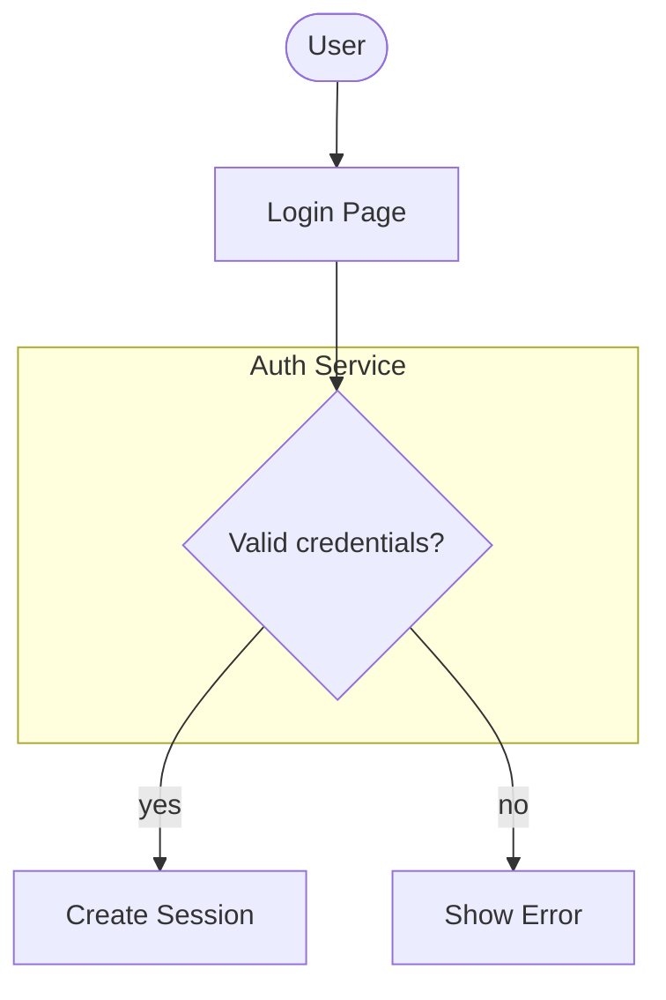
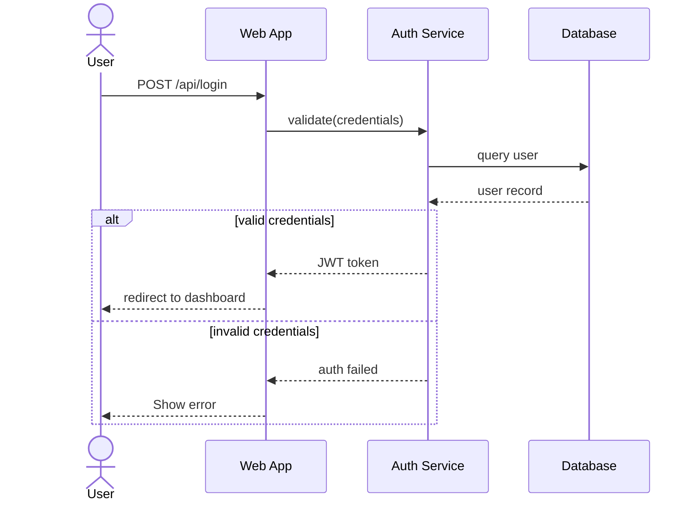

# Login Flow Demo

This file shows how the same Mermaid diagram appears when embedded in Markdown documentation on GitHub.

## Flowchart

## Sequence Diagram

Source files are in the `example/` folder for editing and version control.
